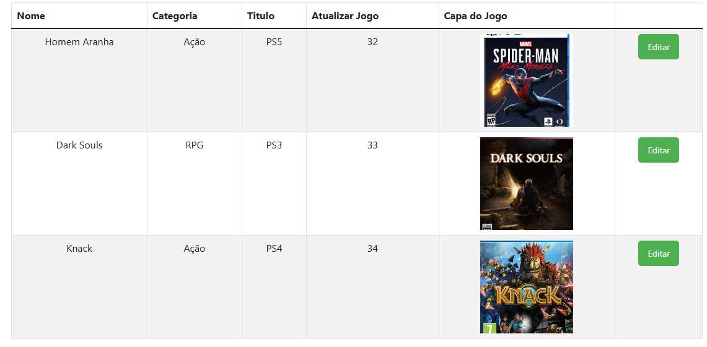

# Jogoteca

Jogoteca é um sistema de cadastro de jogos desenvolvido com Flask e MySQL. Este projeto permite que os usuários se cadastrem, façam login e adicionem novos jogos ao sistema.

## Funinalidasdes 
- **Visualisação**: Visualizar Jogos adicionados
- **Editar Jogos**: Função de editar Jogos




- **Adcionar Jogos**: Função de adicionar Jogos
- **Excluir Jogos**:  Função de Deletar Jogos
- **Login**:  Funcionalidades Disponiveis apaenas para usuarios logados
- **Cadastro**:  Função de Cadastro para usuarios


## Tecnologias Usadas

- **Flask**: Framework web para Python.
- **SQLAlchemy**: ORM para interação com o banco de dados.
- **MySQL**: Banco de dados relacional utilizado para armazenar os jogos e os usuários.
- **Bootstrap**: Framework CSS utilizado para estilizar o front-end.

# Requisitos para o Projeto

Para configurar o ambiente de desenvolvimento, instale as dependências abaixo:


## Instalação

### 1. Clone o repositório
```git clone https://github.com/ale-simoes12/Deposita_jogo.git```


### 2. Baixar o  PyCharm
```A versão usada foi a 2024.3.1.1```


### 3. Baixar o Python

```A versão usada do Python foi a 3.9.9```

### 3. Baixar o Mysql

```A versão usada do Mysql foi a 8.0 CE```
## Dependências

- **Flask**: 2.0.2
- **Flask-SQLAlchemy**: 2.5.1
- **mysql-connector-python**: 8.0.28

As dependências podem ser instaladas a partir do arquivo `requirements.txt`.

Para isso, abra o terminal no diretório onde o projeto está localizado e execute o seguinte comando:


```pip install -r requirements.txt```


